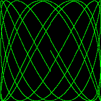

# Exercise 1.5
"Change the [Lissajous](https://github.com/adonovan/gopl.io/blob/b725d6015f980e94734da37e35ba0d943fc7532f/ch1/lissajous/main.go) program's color palette to green on black, for added authenticity.  To create the web color `#RRGGBB`, use `color.RGBA{0xRR, 0xGG, 0xBB, 0xff}`, where each pair of hexadecimal digits represents the intensity of the red, green, or blue component of the pixel."

# Result

