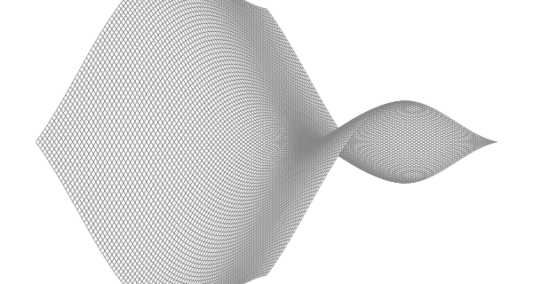

# Description
"Experiment with visualizations of other functions from the `math` package.  Can you produce an egg box, moguls, or a saddle?"

[surface](https://github.com/masonelmore/gopl/blob/0dd25e4ed6cf7311ba0539d8ede1ee8c0684712b/ch3/ex3.1/main.go)

# Results
## Saddle
The saddle is cropped, but I think it's good enough.

