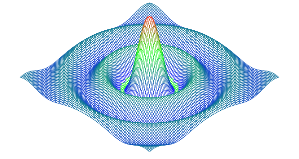

# Description
"Color each polygon based on its height, so that the peaks are colored red (`#ff0000`) and the valleys blue(`#0000ff`)."

[surface](https://github.com/masonelmore/gopl/blob/0dd25e4ed6cf7311ba0539d8ede1ee8c0684712b/ch3/ex3.1/main.go)

# Results

