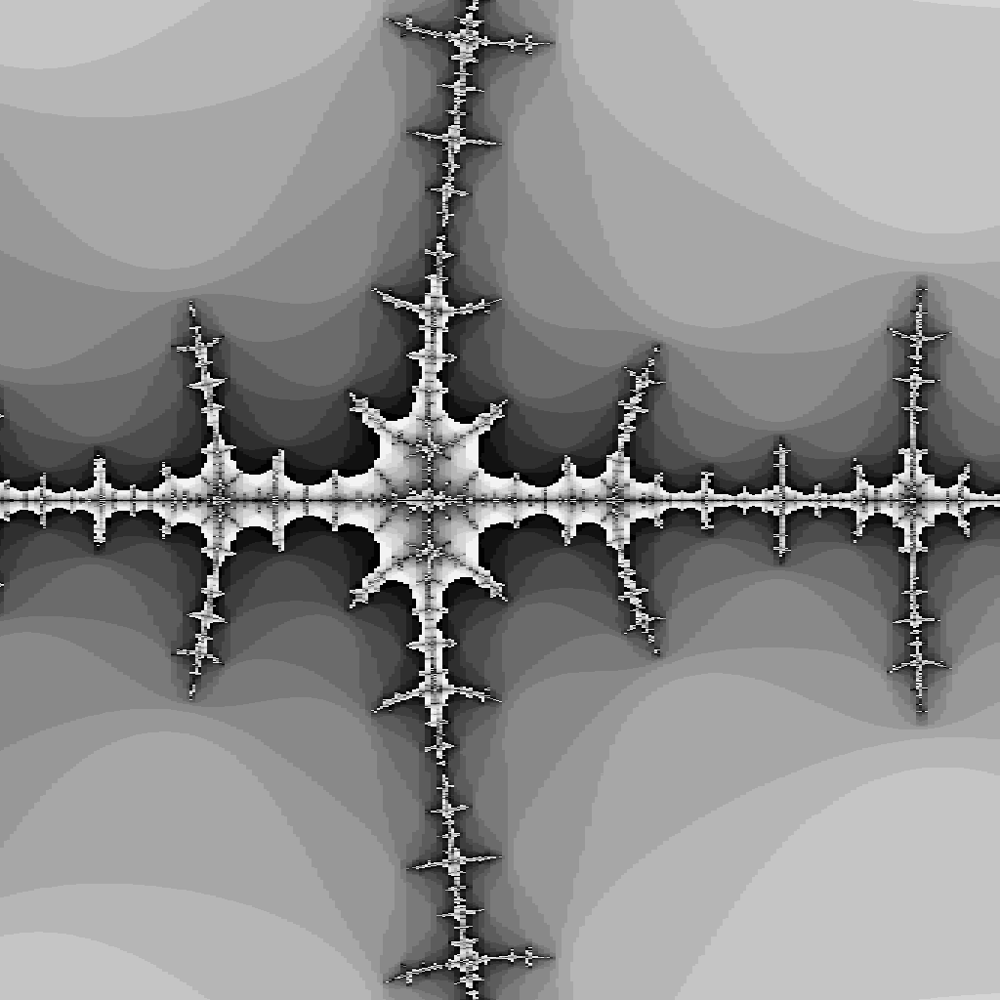
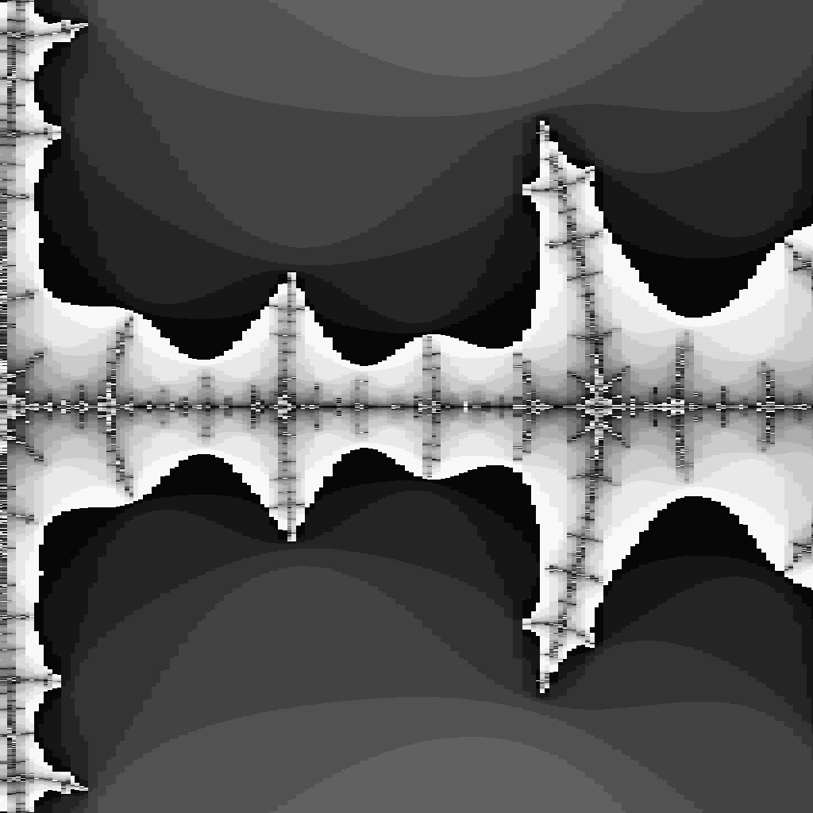
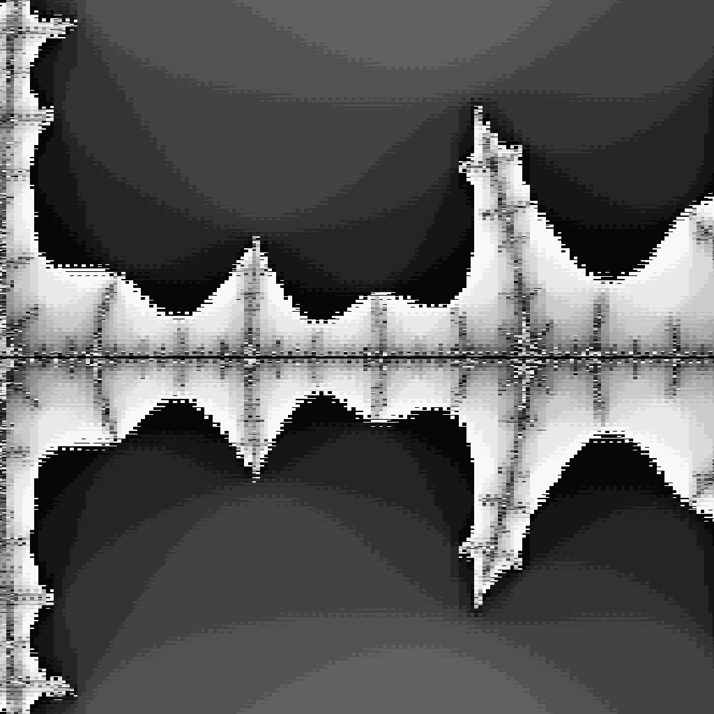

# Description
"Rendering fractals at high zoom levels demands great arithmetic precision. Implement the same fractal using four different representations of numbers: `complex64`, `complex128`, `big.Float`, and `big.Rat`. [...] How do they compare in performance and memory usage?  At what zoom levels do rendering artifacts become visible?"

# Benchmarks
I have omitted the results for `big.Rat` because it is horrendously slow.
```
$ go test ./mandelbrot -bench=. -benchmem
goos: windows
goarch: amd64
pkg: github.com/masonelmore/gopl/ch3/ex3.8/mandelbrot
BenchmarkRenderFuncs/complex64-256-12                100          20691184 ns/op          761342 B/op     124781 allocs/op
BenchmarkRenderFuncs/complex64-512-12                 20          82304710 ns/op         3045562 B/op     499191 allocs/op
BenchmarkRenderFuncs/complex64-1024-12                 5         328818800 ns/op        12182304 B/op    1996979 allocs/op
BenchmarkRenderFuncs/complex64-2048-12                 1        1313075100 ns/op        48730240 B/op    7988227 allocs/op
BenchmarkRenderFuncs/complex128-256-12               100          18171040 ns/op          761342 B/op     124785 allocs/op
BenchmarkRenderFuncs/complex128-512-12                20          71954115 ns/op         3045432 B/op     499197 allocs/op
BenchmarkRenderFuncs/complex128-1024-12                5         289616560 ns/op        12182390 B/op    1996997 allocs/op
BenchmarkRenderFuncs/complex128-2048-12                1        1153066000 ns/op        48730400 B/op    7988263 allocs/op
BenchmarkRenderFuncs/bigfloat-256-12                   1        1244071200 ns/op        448436624 B/op   9451068 allocs/op
BenchmarkRenderFuncs/bigfloat-512-12                   1        4963283900 ns/op        1798066912 B/op 37895046 allocs/op
BenchmarkRenderFuncs/bigfloat-1024-12                  1        19748129500 ns/op       7204265376 B/op 151831295 allocs/op
BenchmarkRenderFuncs/bigfloat-2048-12                  1        79995575500 ns/op       28837111728 B/op        607745380 allocs/op
PASS
ok      github.com/masonelmore/gopl/ch3/ex3.8/mandelbrot        121.219s
```

# Artifacts
Interestingly `big.Float` appears to show artifacts around the same zoom level of `complex128`.  This is probably because all of the `Render` funcs use `float64` to set the bounds of the image.  I have not yet tested if this is the case.

### complex64
Artifacts appear around a zoom level of 1e-05.



### complex128
Artifacts appear around a zoom level of 1e-14.


### big.Float
Artifacts appear around a zoom level of 1e-14.
