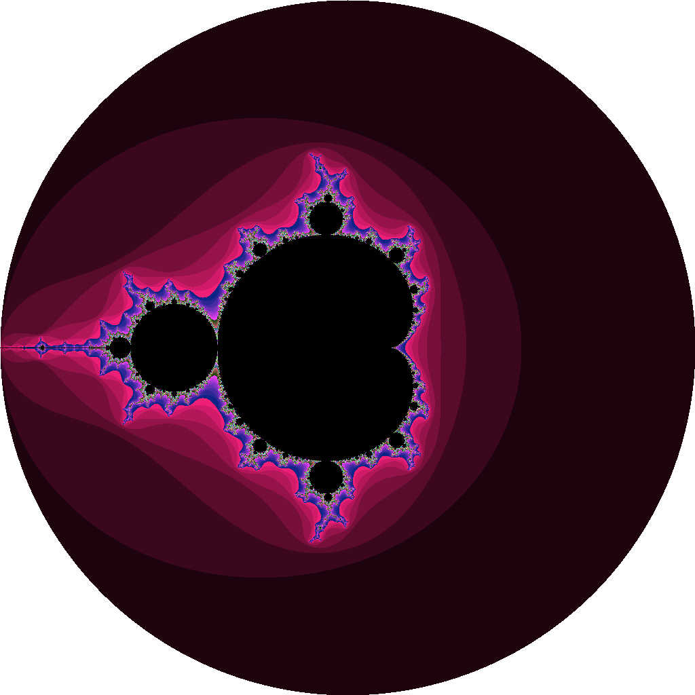

# Exercise 3.5
"Implement a full-color [Mandelbrot](https://github.com/adonovan/gopl.io/blob/b725d6015f980e94734da37e35ba0d943fc7532f/ch3/mandelbrot/main.go) set using the function `image.NewRGBA` and type `color.RGBA` or `color.YCbCr`".

# Results

