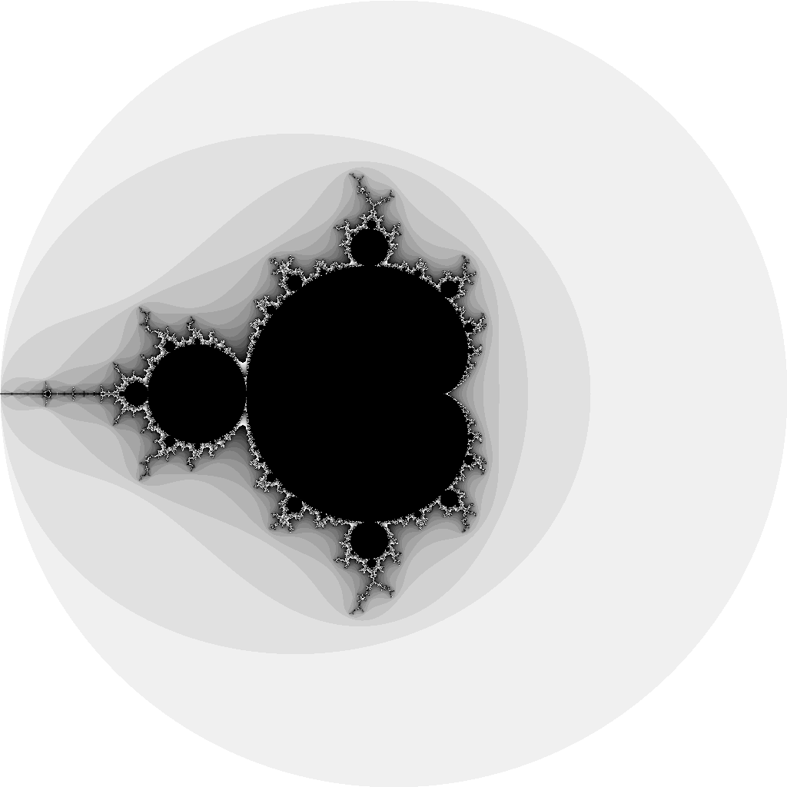
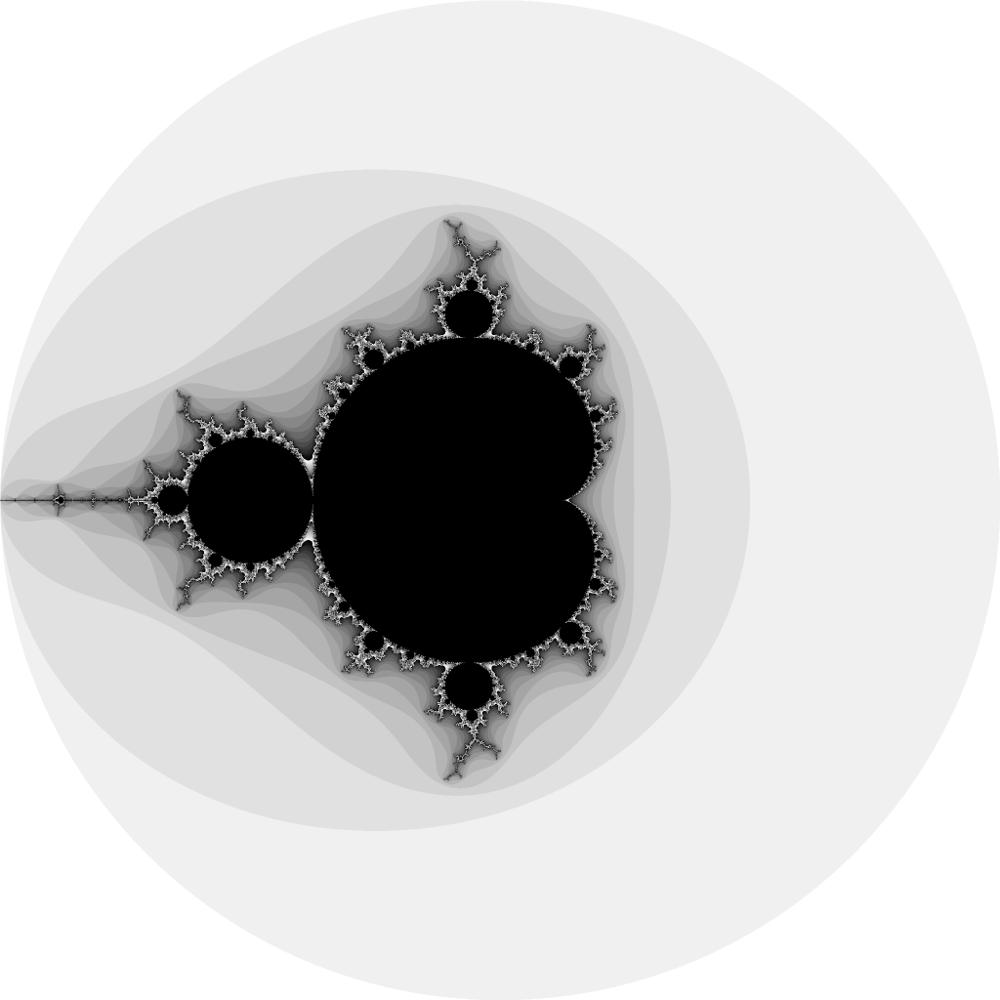

# Exercise 3.6
"Supersampling is a technique to reduce the effect of pixelation by computing the color value at several points within each pixel and taking the average.  The simplest method is to divide each pixel into four 'subpixels.'  Implement it"

See [mandelbrot](https://github.com/adonovan/gopl.io/blob/b725d6015f980e94734da37e35ba0d943fc7532f/ch3/mandelbrot/main.go)

# Results
Normal

Supersample

