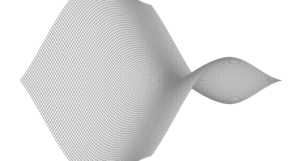

# Exercise 3.2
"Experiment with visualizations of other functions from the `math` package.  Can you produce an egg box, moguls, or a saddle?"

See [surface](FIXME)

# Results
## Saddle
The saddle is cropped, but I think it's good enough.

