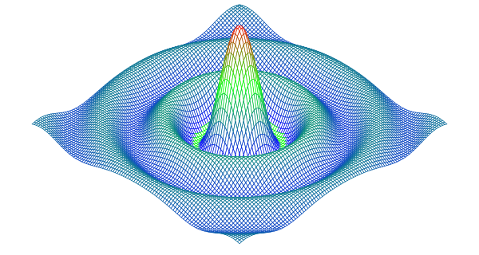

# Exercise 3.3
"Color each polygon based on its height, so that the peaks are colored red (`#ff0000`) and the valleys blue(`#0000ff`)."

See [surface](https://github.com/masonelmore/gopl/blob/b9a3ac1f943c43dbc7c55ffe9d8201ee1f62a628/ch3/surface1/main.go)

# Results

